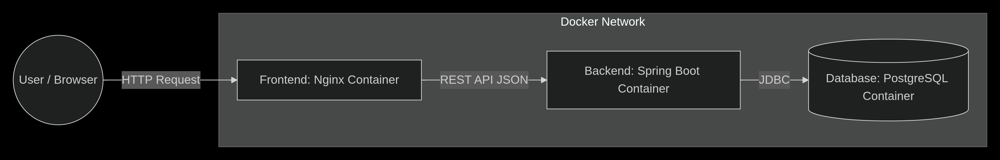

## 🏗 Блок-схема архитектуры

### Ответы на вопросы

#### 1. Зачем нужны Java и Docker?
**Java** — Строгая типизация, надежность, огромная экосистема (Spring), работает на любой ОС.
**Docker** — "У меня работает, а у тебя нет" — проблема решена. Контейнер гарантирует, что приложение запустится везде одинаково. Изоляция процессов.

#### 2. Почему вы захотели быть программистом?
Хочу быть в теме новых технологий и делать то, что сейчас актуально. Люблю работать головой.

#### 3. Почему я ненавижу Windows?
Принудительные обновления в разгар работы, телеметрия и слежка, реклама в меню Пуск, синие экраны смерти, пожирание оперативной памяти просто так, убогая командная строка (cmd/powershell) по сравнению с Bash/Zsh.

#### 4. Интересы любимого преподавателя
**Чернов Сергей Юрьевич** крутой дядька, на волне со студентами, уважает ряженку:)
